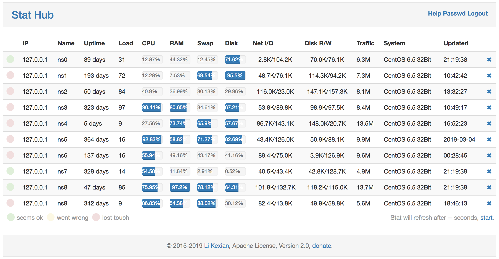

# 总揽

Stat Hub 是一个帮您收集并展示众多服务器状态的服务。

它由两部分组成，一是服务端，用于接收、储存和展示状态；另一个是客户端，它用于收集并发送状态到服务端。而这一切，您只需要一个二进制文件。

## 演示

## 特性

- Golang 编写
- 只需一个文件就可以完成一切
- 支持SSL安全，支持域名访问，安全并简单

## 安装

请选择其中一台服务器做主服务器，并按以下说明在上面安装服务端。

### Linux (如果有curl)

    curl --insecure https://raw.githubusercontent.com/cgw-9527/stathub/master/setup.sh | sh

### Linux (如果有wget)

    wget --no-check-certificate -O - https://raw.githubusercontent.com/cgw-9527/stathub/master/setup.sh | sh

添加一个客户端

####  Linux (如果有wget)

wget --no-check-certificate -O - https://175.6.81.115:15944/node?key=da7b3b785e8c4ece9bbe69b9c4f1a4cc | sh

####  Linux (如果有curl)

curl --insecure https://175.6.81.115:15944/node?key=da7b3b785e8c4ece9bbe69b9c4f1a4cc | sh

